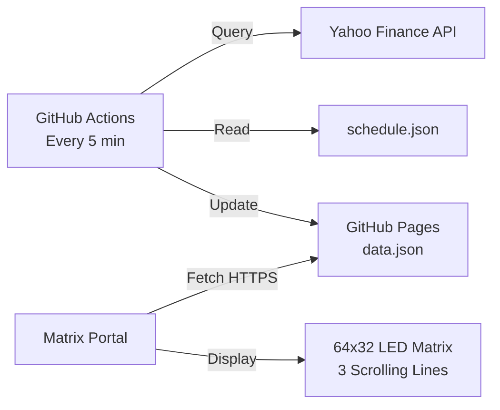

# 3-Line Scrolling Display for Matrix Portal

Real-time multi-line scrolling display showing metro countdown, stock prices, and current time on a 64x32 LED matrix.


## 🎯 Features

- ✅ **Three Lines of Scrolling Text** - Continuous horizontal scrolling
- ✅ **Auto-Updating Data** - GitHub Actions updates every 5 minutes
- ✅ **No Server Required** - Uses GitHub Pages (free hosting)
- ✅ **Metro Countdown** - Next departure with live countdown
- ✅ **Live Stock Prices** - Real-time prices from Yahoo Finance
- ✅ **Current Time & Date** - Always accurate via NTP sync
- ✅ **Smart Fallback** - Uses local schedule if network unavailable
- ✅ **Memory Efficient** - Optimized for 32KB RAM
- ✅ **Color Coded** - Different colors for each data type
- ✅ **Easy Customization** - Change stocks, metro station via config

## 📺 Display Layout

```
Row 0-9:   ← METRO: ROSEMONT • 8 MIN ←              (orange/yellow)
Row 11-20: ← STOCK: XEQT $37.83 +1.2% • CLOSED ←   (green/red)
Row 22-31: ← TIME: 15:30 • FEB 8 ←                  (yellow)
```

Text scrolls continuously from right to left on all three lines simultaneously.

## 🏗️ Architecture



**Key Benefits**:
- No backend server needed
- Free GitHub hosting
- Automatic updates
- Offline fallback

## 🚀 Quick Start

### 1. Clone and Configure

```bash
git clone https://github.com/yourusername/metro.git
cd metro

# Edit config.json with your settings
nano config.json
```

### 2. Set Up GitHub Pages

See detailed guide: [`GITHUB_PAGES_SETUP.md`](GITHUB_PAGES_SETUP.md)

**Quick version**:
1. Enable GitHub Pages in Settings → Pages
2. Select `gh-pages` branch
3. Workflow creates branch automatically on first push

### 3. Push to GitHub

```bash
git add .
git commit -m "Initial setup"
git push origin master
```

GitHub Actions will start running automatically every 5 minutes.

### 4. Deploy to Matrix Portal

See full guide: [`DEPLOYMENT_GUIDE.md`](DEPLOYMENT_GUIDE.md)

**Quick version**:
1. Update `DATA_URL` in `code.py` with your GitHub username
2. Copy files to CIRCUITPY drive:
   - `code.py`
   - `secrets.py` (with WiFi credentials)
   - `schedule.json` (fallback)
3. Install required CircuitPython libraries
4. Restart and enjoy!

## 📁 Project Structure

```
metro/
├── .github/
│   ├── workflows/
│   │   └── update-display-data.yml    # GitHub Actions workflow
│   └── scripts/
│       └── update_data.py             # Data fetching script
├── circuitpython/
│   ├── code.py                        # Main scrolling display (NEW)
│   ├── code_metro.py                  # Original metro code (backup)
│   ├── code_stock.py                  # Stock ticker (backup)
│   └── secrets.py                     # WiFi credentials
├── config.json                        # Configuration file
├── schedule.json                      # Metro schedule data
├── build_schedule.py                  # GTFS schedule builder
├── DEPLOYMENT_GUIDE.md                # Complete deployment guide
├── GITHUB_PAGES_SETUP.md              # GitHub Pages setup
└── README.md                          # This file
```

## ⚙️ Configuration

Edit `config.json` to customize:

```json
{
  "stock_symbol": "XEQT.TO",              // Any Yahoo Finance symbol
  "metro_station": "Rosemont",            // Your station name
  "metro_line": "2",                      // 1=Green, 2=Orange, 4=Yellow, 5=Blue
  "metro_direction": "Côte-Vertu",        // Destination
  "timezone": "America/Montreal",         // Your timezone
  "update_interval": 300,                 // Seconds between data updates
  "github_pages_url": "https://...",     // Your GitHub Pages URL
  "display": {
    "brightness": 0.3,                    // 0.0 to 1.0
    "scroll_speed": 0.05,                 // Seconds per pixel (lower = faster)
    "line_spacing": 1                     // Pixels between lines
  }
}
```

**No code changes needed!** Just edit config and commit.

## 🎨 Customization Examples

### Different Stock

```json
{
  "stock_symbol": "AAPL",     // Apple
  "stock_symbol": "TSLA",     // Tesla
  "stock_symbol": "BTC-USD"   // Bitcoin
}
```

### Different Metro Station

```bash
# Edit config.json
nano config.json  # Change station, line, direction

# Regenerate schedule
python build_schedule.py

# Commit and push
git add config.json schedule.json
git commit -m "Update metro station"
git push
```

### Adjust Scroll Speed

Edit `code.py`:
```python
SCROLL_SPEED = 0.08  # Slower
SCROLL_SPEED = 0.03  # Faster
```

### Change Colors

Edit `code.py`:
```python
COLOR_ORANGE = (255, 150, 0)   # Brighter metro
COLOR_GREEN = (0, 255, 100)    # Mint green stocks
COLOR_YELLOW = (255, 255, 0)   # Bright yellow time
```

## 🔧 Hardware Requirements

- **Adafruit Matrix Portal M4** (~$25)
- **64x32 RGB LED Matrix Panel** (~$30-50)
- **5V 4A Power Supply** (~$10)
- **USB-C Cable** for programming

**Total**: ~$70-90

## 📊 Data Sources

- **Stock Prices**: Yahoo Finance API (free, no key needed)
- **Metro Schedule**: Local GTFS data from STM
- **Current Time**: NTP time sync via WiFi

## 🧪 Testing

### Test Data Script Locally

```bash
# Install dependencies
pip install -r requirements.txt

# Run data script
python .github/scripts/update_data.py

# View output
cat data.json | python -m json.tool
```

### Monitor Matrix Portal

Connect to serial console:

**Windows**: Use Mu Editor
**Mac/Linux**: `screen /dev/tty.usbmodem* 115200`

Watch for:
- WiFi connection status
- Data fetch success
- Memory usage
- Error messages

## 🐛 Troubleshooting

### Display Stuck on "STARTING"

**Issue**: WiFi connection failed

**Fix**:
- Check credentials in `secrets.py`
- Ensure WiFi is 2.4GHz (not 5GHz)
- Verify signal strength

### No Data / Shows "OFFLINE"

**Issue**: Can't reach GitHub Pages

**Fix**:
- Test URL in browser: `https://username.github.io/metro/data.json`
- Check GitHub Actions completed successfully
- Wait 5 minutes for next update attempt

### Text Not Scrolling

**Issue**: Code frozen or crashed

**Fix**:
- Press RESET button on Matrix Portal
- Check serial console for errors
- Verify free memory > 15KB

### Stock Shows $0.00

**Issue**: Invalid symbol or API error

**Fix**:
- Check GitHub Actions logs for errors
- Try known good symbol (e.g., "AAPL")
- Verify internet connection

### Memory Errors

**Issue**: Ran out of RAM

**Fix**:
- Check free memory in serial console
- Shorten text strings in `update_data.py`
- Restart Matrix Portal

## 📈 Performance

Typical metrics on Matrix Portal M4:

- **Free RAM**: 26-28KB (out of 32KB)
- **Scroll FPS**: ~30 FPS
- **Network request**: 2-3 seconds
- **Boot time**: 8-10 seconds
- **Data update**: Every 5 minutes

## 🔄 Maintenance

**Weekly**: Check GitHub Actions still running

**Monthly**: Verify data updates and memory usage

**Quarterly**: 
- Update CircuitPython libraries
- Regenerate metro schedule (STM updates)
- Check for optimizations

## 📚 Documentation

- **[Deployment Guide](DEPLOYMENT_GUIDE.md)** - Complete deployment instructions
- **[GitHub Pages Setup](GITHUB_PAGES_SETUP.md)** - Configure GitHub hosting
- **[Hardware README](circuitpython/README.md)** - Matrix Portal setup
- **[Original Project](README.md)** - Metro countdown display

## 💡 How It Works

1. **GitHub Actions** runs every 5 minutes
2. Python script queries:
   - Yahoo Finance for stock prices
   - Local schedule for next metro
   - System time for current time
3. Generates `data.json` and commits to `gh-pages`
4. **GitHub Pages** serves the file via HTTPS
5. **Matrix Portal** fetches JSON every 5 minutes
6. **CircuitPython** code:
   - Parses JSON data
   - Creates 3 scrolling text lines
   - Animates at 30 FPS
   - Updates text when new data arrives

## 🌟 Why This Approach?

**vs. Direct API Calls**:
- ✅ Single HTTP request (less memory)
- ✅ Faster response time
- ✅ Combined data source
- ✅ Simpler error handling

**vs. Running a Server**:
- ✅ No hosting costs
- ✅ No server maintenance
- ✅ Automatic scaling
- ✅ Built-in SSL/HTTPS

**vs. Adafruit IO**:
- ✅ No rate limits
- ✅ No account required
- ✅ More flexible
- ✅ Familiar GitHub workflow

## 🤝 Contributing

Improvements welcome! Consider:

- Additional data sources (weather, crypto, etc.)
- Alternative display layouts
- Web-based configuration interface
- More animation effects
- Custom fonts

## 📝 License

MIT License - Free to use and modify

## 🙏 Acknowledgments

- [Adafruit](https://www.adafruit.com/) for Matrix Portal hardware
- [STM](https://www.stm.info/) for GTFS transit data
- [Yahoo Finance](https://finance.yahoo.com/) for free stock API
- Montreal metro riders 🚇

## 🎯 Next Steps

Ready to deploy? Follow the **[Deployment Guide](DEPLOYMENT_GUIDE.md)**!

Questions? Check the troubleshooting section or open an issue on GitHub.

---

**Made with 🚇📈⏰ for real-time info displays**

**Star ⭐ this repo if you find it useful!**
